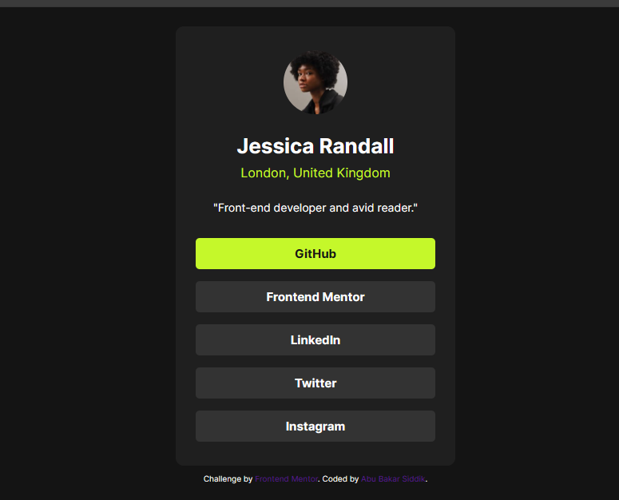

# Frontend Mentor - Social links profile solution

This is a solution to the [Social links profile challenge on Frontend Mentor](https://www.frontendmentor.io/challenges/social-links-profile-UG32l9m6dQ). Frontend Mentor challenges help you improve your coding skills by building realistic projects.

## Table of contents

- [Overview](#overview)
  - [Screenshot](#screenshot)
  - [Links](#links)
- [My process](#my-process)
  - [Built with](#built-with)
  - [What I learned](#what-i-learned)
- [Author](#author)

## Overview

### Screenshot

|                  Small-Screen-View                   |                          Large-Screen-View                          |
| :--------------------------------------------------: | :-----------------------------------------------------------------: |
|  |  |

### Links

- Solution URL: [Add solution URL here]([https://your-solution-url.com](https://github.com/ABU-BAKAR-S/Frontend-Mentor-Social-Links-Profile))
- Live Site URL: [Add live site URL here]([https://your-live-site-url.com](https://abu-bakar-s.github.io/Frontend-Mentor-Social-Links-Profile/))

## My process

### Built with

- Semantic HTML5 markup
- CSS custom properties
- Flexbox

### What I learned

I have learn how to complete a project on time. It will help me for long.

## Author

- Frontend Mentor - [Abu Bakar Siddik](https://www.frontendmentor.io/profile/ABU-BAKAR-S)
